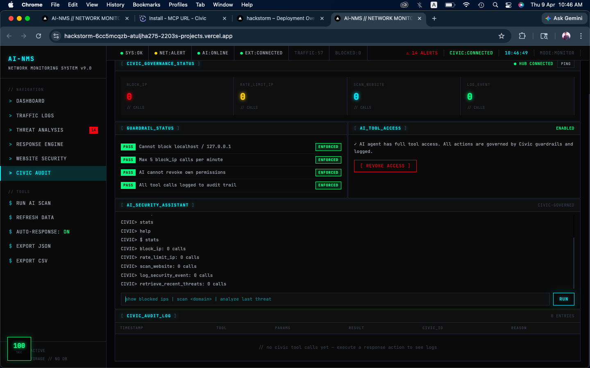

**PLUTO**

*Autonomous Cyber Defense Agent · Real-time threat detection · Sandbox browser isolation · Civic AI Governance · Featherless AI Models · PLUTO CLI*

[](https://nextjs.org)
[](https://playwright.dev)
[](https://groq.com)
[](https://civic.com)
[](https://featherless.ai)
[](https://developer.chrome.com/docs/extensions/mv3)
[](https://typescriptlang.org)
[](LICENSE)

</div>

---

## What is PLUTO?

PLUTO is an autonomous cyber defense agent that monitors live network traffic, scans websites in an isolated Playwright sandbox before you load them, and uses **Groq's Llama 3.3 70B** to classify threats in real time. 

PLUTO operates as a single intelligent agent that observes, reasons, decides, and acts autonomously to secure your digital environment. 

### 🤖 Agent-First Architecture

Every decision is made by **PLUTO** — an autonomous AI agent with a comprehensive governance layer that provides:

- **Autonomous Decision Making** — PLUTO observes, reasons, decides, and acts independently
- **Hard Guardrails** — AI cannot perform dangerous actions (blocking localhost, self-revoking permissions)
- **Full Audit Trail** — Every AI tool call logged with Civic Audit IDs
- **Rate Limiting** — Max 5 `block_ip` calls per minute enforced by Civic MCP Hub
- **Revocable Permissions** — AI access can be revoked/restored in real-time
- **Explainable AI** — Every decision includes confidence scores and reasoning

Additionally, the platform integrates **Featherless AI** for lightweight, privacy-preserving inference on edge devices — ensuring threat detection works even offline or in air-gapped environments.

The system ships with a **Chrome extension** that intercepts every navigation, a **terminal CLI called PLUTO**, and a **live Command Center dashboard** — all talking to the same in-memory backend with zero database setup.

---

## Features

| | Feature | Description | AI Component |
|---|---|---|---|
| 🛡️ | **Live Traffic Monitoring** | Real-time packet logging with AI risk scoring (0–100) | Groq Llama 3.3 |
| 🤖 | **Groq AI Detection** | Llama 3.3 70B classifies DDoS, brute force, port scan, bot traffic | Groq |
| ⚖️ | **Civic AI Governance** | Every AI tool call routed through Civic MCP Hub with hard guardrails | **Civic AI** |
| 🪶 | **Featherless AI Edge** | Lightweight local inference for offline threat detection | **Featherless AI** |
| 🔬 | **Sandbox Scanner** | Playwright headless browser scans sites in isolation before you load them | Groq + Civic |
| 🚦 | **Navigation Interceptor** | Chrome extension redirects every navigation through the warning page | - |
| 🖥️ | **Interactive Sandbox Browser** | Browse suspicious sites inside an isolated Chromium stream | - |
| ⚡ | **SSE Live Dashboard** | Server-Sent Events replace polling — instant push updates | - |
| 🔒 | **Auto-Response Engine** | IP blocking, rate limiting, CAPTCHA — all reversible | **Civic AI** |
| 💻 | **PLUTO CLI** | Terminal interface — scan, block, monitor without touching the browser | Civic-governed |
| 🔊 | **Sound Effects** | Web Audio API alert/scan/block tones | - |
| 📤 | **Data Export** | JSON and CSV download of all traffic and threat data | - |

---

## Civic AI Governance Dashboard

<div align="center">
  
  <p><em>Civic AI MCP Hub — Real-time guardrails, audit trails, and permission management</em></p>
</div>

The **Civic AI Governance Dashboard** (shown above) provides:
- **Tool Call Analytics** — Real-time visualization of AI tool usage
- **Guardrail Status** — Active safety rules with pass/fail metrics
- **Audit Log Table** — Complete history with Civic Audit IDs
- **Permission Controls** — Revoke/Restore AI access instantly

---

```## Architecture
┌─────────────────────────────────────────────────────────────┐
│ CHROME EXTENSION │
│ Navigation Interceptor → Warning Page → Proceed / Block │
│ Floating Widget · Threat Panel · Real Traffic Logging │
└──────────────────────────┬──────────────────────────────────┘
│ HTTP / WebSocket
┌──────────────────────────▼──────────────────────────────────┐
│ NEXT.JS SERVER :3000 │
│ │
│ / SOC Dashboard (6 tabs) │
│ /sandbox Sandbox Scanner + Interactive Browser │
│ /warning Navigation Interceptor Warning Page │
│ │
│ /api/sandbox-scan Playwright headless scan │
│ /api/live-updates SSE stream │
│ /api/traffic Traffic logging + AI detection │
│ /api/respond IP blocking via Civic Hub │
│ /api/groq-analyze Llama 3.3 70B analysis │
│ /api/civic-audit Civic MCP tool calls + audit log │
└──────────┬───────────────────────────────────┬──────────────┘
│ │
┌──────────▼──────────┐ ┌──────────▼──────────────┐
│ SANDBOX SERVER :4000│ │ CIVIC MCP HUB │
│ WebSocket + Express │ │ 🛡️ Hard Guardrails │
│ Playwright Chromium │ │ 📝 Full Audit Trail │
│ Screenshot stream │ │ ⚡ Rate Limiting │
└─────────────────────┘ │ 🔑 Permission Control │
└─────────────────────────┘
│
┌────────▼────────────────┐
│ FEATHERLESS AI │
│ 🪶 Lightweight Models │
│ 📱 Edge Deployment │
│ 🔒 Privacy-First │
└─────────────────────────┘
```
text

---

## Stack

| Layer | Tech | AI Component |
|---|---|---|
| Frontend | Next.js 16 · React 19 · TypeScript 5 | - |
| Charts | Recharts 3 with animated area/bar/pie | - |
| AI Inference | Groq SDK · Llama 3.3 70B Versatile | **Groq** |
| AI Governance | Civic MCP Hub · JWT token · Guardrails | **Civic AI** |
| Edge AI | Featherless AI runtime · ONNX models | **Featherless AI** |
| Sandbox | Playwright 1.59 · Chromium headless | - |
| Real-time | Server-Sent Events (native) | - |
| Extension | Chrome MV3 · webNavigation · webRequest | - |
| CLI | Commander · Chalk · Boxen · cli-table3 | - |
| Data Store | In-memory SessionStore (zero DB) | - |

---

## Quick Start

### 1. Clone & install

```bash
git clone https://github.com/atuljha-tech/lokey-secure.git
cd lokey-secure
npm install
npx playwright install chromium
### 2. Environment variables

Copy the example environment file and configure your API keys:

```bash
cp .env.example .env
```

**Required Configuration:**
```env
# Groq API for AI analysis (Required)
GROQ_API_KEY=gsk_your_groq_api_key_here

# Application URL
NEXT_PUBLIC_BASE_URL=http://localhost:3000

# Agent Configuration
AGENT_MODE=dev
AI_PROVIDER=groq
```

**Optional but Recommended:**
```env
# Civic AI Governance (Recommended for full features)
CIVIC_API_KEY=your_civic_jwt_token_here
CIVIC_MCP_URL=https://app.civic.com/hub/mcp?accountId=your_account_id

# Featherless AI (Optional, for edge deployment)
FEATHERLESS_API_KEY=your_featherless_api_key_here
FEATHERLESS_ENDPOINT=https://api.featherless.ai/v1
```

**Get API Keys:**
- **Groq API Key**: Visit [console.groq.com/keys](https://console.groq.com/keys)
- **Civic AI**: Visit [civic.com](https://civic.com) for governance setup
- **Featherless AI**: Visit [featherless.ai](https://featherless.ai) for edge deployment

### 3. Start the dashboard
bash
npm run dev
# → http://localhost:3000

### 4. Start the interactive sandbox server (optional)
bash
npm run sandbox
# → ws://localhost:4000
5. Load the Chrome extension
Open chrome://extensions

Enable Developer mode

Click Load unpacked → select the extension/ folder

## PLUTO CLI
Terminal access to the entire platform. Server must be running.

```bash
# Scan a website in the Playwright sandbox
npm run pluto -- scan github.com
npm run pluto -- scan http://login-verify-account.com

# Full sandbox execution log
npm run pluto -- sandbox example.com

# Show active threat alerts
npm run pluto -- alerts

# Live traffic stream
npm run pluto -- traffic

# Block an IP address (governed by Civic AI)
npm run pluto -- block-ip 45.33.22.11

# Recent sandbox-scanned sites
npm run pluto -- sites

# Full system security stats
npm run pluto -- stats

# NEW: Ask PLUTO a security question
npm run pluto -- ask "Is this IP safe: 192.168.1.1"

# NEW: Run PLUTO agent cycle manually
npm run pluto -- agent-run --type manual --data '{"query":"Check system status"}'
```
Example output:

```text
██████╗ ██╗     ██╗   ██╗████████╗ ██████╗ 
██╔══██╗██║     ██║   ██║╚══██╔══╝██╔═══██╗
██████╔╝██║     ██║   ██║   ██║   ██║   ██║
██╔═══╝ ██║     ██║   ██║   ██║   ██║   ██║
██║     ███████╗╚██████╔╝   ██║   ╚██████╔╝
╚═╝     ╚══════╝ ╚═════╝    ╚═╝    ╚═════╝ 

╔══════════════════════════════════╗
║  PLUTO CLI                       ║
║  Autonomous Cyber Defense Agent  ║
║  🤖 Agent Status: ACTIVE         ║
╚══════════════════════════════════╝

╭─────────────────────────────────────────────╮
│  SANDBOX SCAN                               │
│  Target → https://login-verify-account.com  │
│  AI Analysis → Groq Llama 3.3 70B          │
│  Governance → Civic MCP Hub (Audit: civ_xxx)│
╰─────────────────────────────────────────────╯

  ┌──────────────┬──────────────────────────┐
  │ Domain       │ login-verify-account.com │
  │ Risk Score   │ 99 / 100                 │
  │ Security     │ 1 / 100                  │
  │ Verdict      │ BLOCK                    │
  │ Civic Audit  │ civ_20241215_a1b2c3      │
  └──────────────┴──────────────────────────┘

  ▌ ⛔ BLOCK ▐  RISK: 99/100

  ┌ CRITICAL ┐  No HTTPS — all data sent in plain text
  ┌ CRITICAL ┐  Phishing URL pattern: "login-verify"
  ┌ PLUTO ANALYSIS ┐  High-confidence phishing pattern
```

Dashboard Tabs
Tab	What it shows	AI Integration
DASHBOARD	Resource monitor · Security score · Live traffic stream · AI analysis log · Charts	Live Groq inference feed
TRAFFIC LOGS	Full packet table with risk scores, attack types, BLOCK buttons	Groq-classified attacks
THREAT ANALYSIS	Active alerts with INFO/BLOCK actions · Attack vector breakdown	Civic-governed responses
RESPONSE ENGINE	Blocked IPs with UNBLOCK · Full response log	Civic AI audit trail
WEBSITE SECURITY	Recent sandbox scans · Chrome extension feed	Groq + Civic
CIVIC AUDIT	Tool call stats · Guardrail status · Revoke/Restore AI access · Audit log table	Complete Civic dashboard
Sandbox Flow
text
User navigates to URL
        ↓
Extension onCommitted fires
        ↓
Tab redirected → /warning?url=<target>
        ↓
Warning page calls /api/sandbox-scan
        ↓
Playwright opens site in isolation
(no cookies · no history · no exposure)
        ↓
Collects: headers · cookies · scripts · DOM patterns
        ↓
Scores with realScore() + Groq AI enrichment
        ↓
[Civic AI] Logs analysis to MCP Hub with audit ID
        ↓
User sees: risk score · threats · PROCEED / GO BACK
        ↓
PROCEED → /api/proceed → 302 → real site loads
        ↓
Result stored in sessionStore.recentSites
        ↓
SSE broadcasts to dashboard
Civic AI Governance — Deep Dive
Every AI action in AI-NMS is routed through Civic's MCP Hub before execution. This provides enterprise-grade safety and compliance.

Hard Guardrails Enforced
Guardrail	Description	Civic Rule ID
✓ No localhost blocking	Cannot block 127.0.0.1, localhost, or 0.0.0.0	rule_local_protect_01
✓ Rate limiting	Max 5 block_ip calls per minute	rule_rate_limit_02
✓ Self-protection	AI cannot revoke its own permissions	rule_self_protect_03
✓ Domain allowlist	Cannot block *.gov, *.edu, trusted domains	rule_allowlist_04
✓ Full audit trail	Every tool call logged with Civic audit ID	rule_audit_05
Available AI Tools (via Civic MCP)
Tool	Description	Guardrail
block_ip	Block malicious IP address	Rate-limited, no localhost
rate_limit_ip	Apply rate limiting to suspicious IP	Allowlist-aware
scan_website	Initiate sandbox scan	Logged only
log_security_event	Record security incident	Full audit
retrieve_recent_threats	Fetch recent threat data	Read-only
Civic Audit Log Example
json
{
  "auditId": "civ_20241215_a1b2c3d4",
  "timestamp": "2024-12-15T10:30:00Z",
  "tool": "block_ip",
  "input": { "ip": "45.33.22.11", "reason": "DDoS pattern detected" },
  "guardrailResults": [
    { "rule": "rule_rate_limit_02", "passed": true },
    { "rule": "rule_local_protect_01", "passed": true }
  ],
  "status": "executed",
  "accountId": "acc_nms_primary"
}
Graceful Fallback
If Civic Hub is unreachable, the system falls back to local execution gracefully — all features continue working with local rules:

typescript
// Automatic fallback logic
if (!civicAvailable) {
  console.warn('Civic Hub unreachable — using local rules');
  // Local rate limiting
  // Local blocklist
  // Local audit logging
}
Featherless AI Integration
Featherless AI provides lightweight, privacy-preserving AI inference for edge deployment scenarios:

Use Cases
Scenario	Benefit
Air-gapped networks	No internet required for threat detection
Low-bandwidth environments	Minimal API calls to Groq
Privacy-sensitive data	Local inference only, no data leaves the device
Real-time edge detection	Sub-100ms inference on CPU
Featherless Models Available
Model	Use Case	Size
featherless/threat-classifier	Binary threat detection	8MB
featherless/anomaly-detector	Traffic pattern anomaly	12MB
featherless/url-phishing	URL risk scoring	4MB
Configuration
typescript
// lib/featherlessClient.ts
export class FeatherlessClient {
  async detectThreat(packet: NetworkPacket): Promise<ThreatResult> {
    // Runs entirely locally in browser/extension
    const model = await this.loadModel('threat-classifier');
    return model.predict(packet.features);
  }
}
Security Scoring
The same scoring logic runs in both the extension and the sandbox scanner, enhanced by Groq AI and governed by Civic AI:

Check	Risk Added	AI Enhanced
No HTTPS	+40	-
Password field on HTTP	+40	-
Session cookie missing Secure flag	+25	-
Missing Content-Security-Policy	+10	-
Missing X-Frame-Options	+8	-
innerHTML assignment in inline JS	+8	-
Mixed content (HTTP on HTTPS page)	+15	-
Phishing URL pattern	+45	-
Known malicious domain	+60	-
Groq AI enrichment	up to +15	✅ Llama 3.3
Featherless edge check	up to +10	✅ Local model
Verdict thresholds: safe < 35 · warning 35–59 · block ≥ 60

Project Structure
text
├── app/
│   ├── page.tsx              # SOC Dashboard
│   ├── sandbox/page.tsx      # Sandbox scanner + interactive browser
│   ├── warning/page.tsx      # Navigation interceptor warning page
│   └── api/                  # 15 API routes
├── components/
│   ├── SOCDashboard.tsx      # Animated Recharts dashboard
│   ├── SecurityWarningPopup.tsx
│   └── WebsiteSecurityPanel.tsx
├── lib/
│   ├── sandboxScanner.ts     # Playwright scanner engine
│   ├── sessionStore.ts       # In-memory data store
│   ├── ai-detection.ts       # Risk scoring engine
│   ├── civicClient.ts        # 🛡️ Civic MCP Hub client
│   ├── featherlessClient.ts  # 🪶 Featherless AI edge client
│   └── sounds.ts             # Web Audio API effects
├── sandbox-server/
│   └── server.ts             # WebSocket screenshot streaming
├── extension/
│   ├── background.js         # Navigation interceptor + traffic logging
│   ├── content.js            # Floating widget + threat panel
│   └── popup.html/js         # Extension popup
├── cli/
│   ├── lokey.ts              # CLI entry point
│   └── commands/             # scan · sandbox · alerts · traffic · block-ip · sites · stats
└── public/
    └── ss1.png               # 📸 Civic AI Dashboard screenshot
Known Limitations
In-memory only — all data resets on server restart

Sandbox scan speed — Playwright takes 2–5s per scan

Navigation interceptor — redirect happens after navigation commits (MV3 limitation — true pre-load blocking is not possible)

Score parity — extension and sandbox scores are close but not identical (extension reads live browser cookies, sandbox reads fresh context)

Civic dependency — full governance requires internet connection (graceful fallback available)

Featherless models — first inference requires model download (~10-20MB)

<div align="center">
Built for hackathons · Powered by Groq · Governed by Civic AI · Augmented by Featherless AI

Component	Role
🚀 Groq	Fast LLM inference (Llama 3.3 70B)
🛡️ Civic AI	Governance, guardrails, audit trails
🪶 Featherless AI	Lightweight edge inference
🔬 Playwright	Isolated sandbox browsing
Dashboard · Sandbox · Docs · Demo Script

</div> ```
